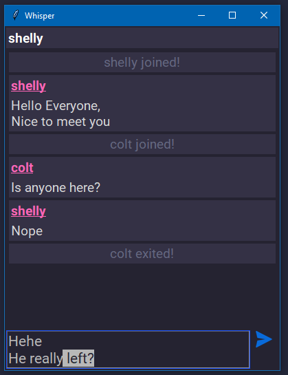

<div align="center">
    <h1>Whisper - Chat Application</h1>
    <i>Chat App</i>
</div>


## About

This is a chat application made using python & tkinter. The project aims
to create a simple chat app that can be hosted locally (for now). The
application requires tkinter for ui and no other external packages other
than standard libraries.


## Features
1. Allows only text messages (unicode supported)
2. Responsive UI
3. User can chage their username
    * double click it to change the username
    * escape/focusout to cancel
    * enter to change name


## Usage
Command line usage:
```sh
python -m whisper -h
```

Server:
```sh
python -m whisper server --host 127.0.0.1 --port 50000
```

Client:
```sh
python -m whisper client --host 127.0.0.1 --port 50000 -u sparrow
```


## Demo
<div align="center">

</div>


## Development
* OS: windows & linux (wsl)
* python: 3.11
